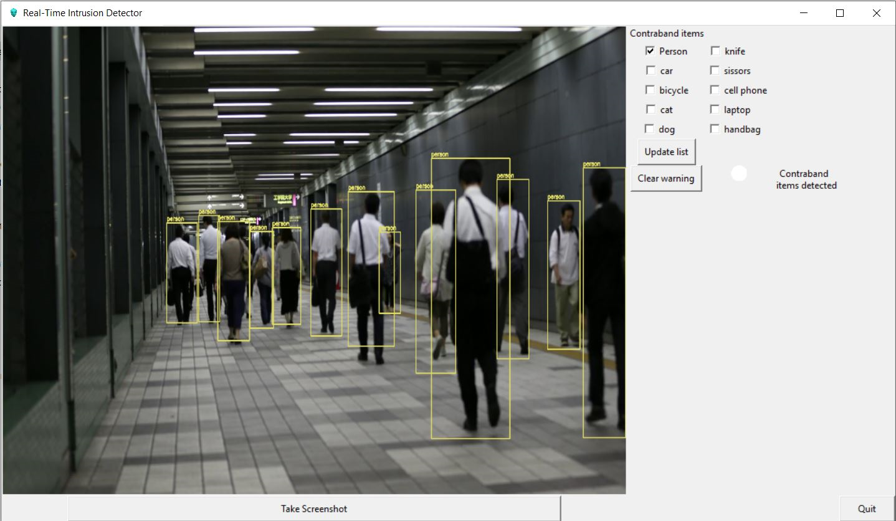

# Real-time Intrusion Detector

This project is an application that tracks movement and objects that are visible in a video feed. These objects are checked against available models and if they match a dangerous object that is restricted, and if the accuracy percentage is high, the application flags the object and person in a box and prompts the user. A screenshot is saved of the object and person, and a message is sent to the designated person indicating the detection of contraband. The designated person can remotely view the item and disable the prompt remotely if necessary.

## Features

- Tracks movement and objects visible in a video feed
- Uses YoloV4 model and computer vision
- Checks objects against restricted models
- Flags objects and person in a box if accuracy percentage is high
- Saves screenshot of the object and person
- Sends a message to the designated person indicating detection of contraband
- Allows designated person to remotely view the item and disable prompt if necessary

## Installation

To install this application, follow these steps:

1. Clone the repository: 
    git clone https://github.com/arshad-syed18/Real-time-intrusion-detector.git

2. Change `telegram-send.conf` with your own details.

3. Run the application:
    python3 objdet.py
  Alternatively, you can run `objdet_original.exe`.
 
## Usage

Once the application is installed and running, it will begin monitoring the video feed. 
If any restricted objects are detected, the application will flag them and send a message to the designated person. 
The designated person can then remotely view the item and disable the prompt if necessary.

Here are some images to give you an idea of how the application works:

### First Screen
When the application is launched, it shows the above screen with the objects being highlighted in bounding boxes 

### Update Contraband Items
Select the items which are deemed as contraband. Click on update list. The user will be prompted upon detection of the marked objects.

### Detected

  

    When an unauthorized object is detected, the user is prompted about the detection on the UI and a telegram message is sent.
    
  

  

    A telegram message showing object, name, and time of detection.
     
    
  

### Warning Cleared

  

    When an unauthorized object is cleared, the user is prompted about the cleared warning on the UI and a telegram message is sent.
    
  

  

    A telegram message showing object, name, and time of cleared warning.
     
    
  

